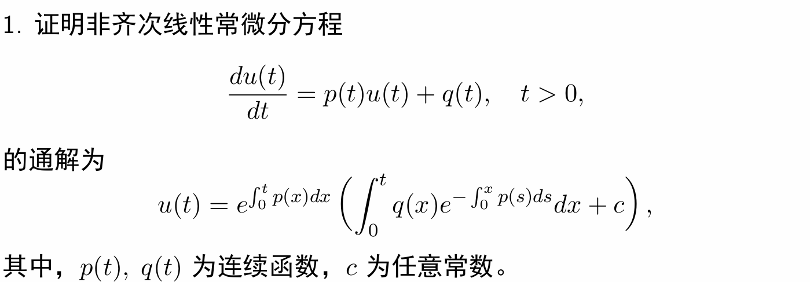
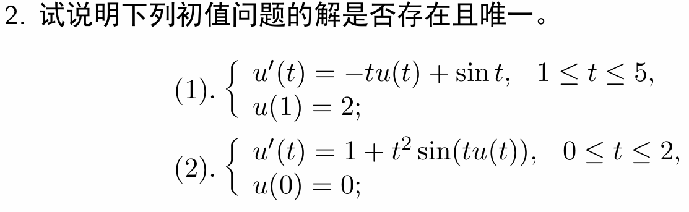

证明:

   \[
   \frac{du}{dt} - p(t)u = q(t).
   \]

   令：  
   \[
   \mu(t) = e^{-\int_0^t p(s)ds}.
   \]为积分因子

   两边乘以积分因子得：  
   \[
   e^{-\int_0^t p(s)ds} \frac{du}{dt} - p(t)e^{-\int_0^t p(s)ds} u = q(t)e^{-\int_0^t p(s)ds}.
   \]  
   即：  
   \[
   \frac{d}{dt} \left[ u \cdot e^{-\int_0^t p(s)ds} \right] = q(t)e^{-\int_0^t p(s)ds}.
   \]

   有
   \[
   u(t) \cdot e^{-\int_0^t p(s)ds} - u(0) = \int_0^t q(x)e^{-\int_0^x p(s)ds} dx.
   \]  

   令常数 \(c = u(0)\)，则：  
   \[
   u(t) = e^{\int_0^t p(x)dx} \left( \int_0^t q(x)e^{-\int_0^x p(s)ds} dx + c \right).
   \]为原方程的通解

---

#### (1)

令$$f(t,u)=-tu+\sin{t} $$，有$$\frac{\partial}{\partial u} f(t,u)= -t$$

由$t\in [1,5]$，故$|\frac{\partial}{\partial u} f(t,u)|\leq 5 $，因此关于$u$满足Lipschitz条件。

故其解存在且唯一。

#### (2)

令$$f(t,u)=1+t^2\sin{tu} $$，有$$\frac{\partial}{\partial u} f(t,u)= t^3\cos{tu} $$

由$t\in [0,2]$，故$|\frac{\partial}{\partial u} f(t,u)|\leq 125 $，因此关于$u$满足Lipschitz条件。

故其解存在且唯一。

