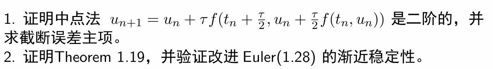

## 证明改进Euler法渐进稳定

$$u_n = u_{n-1}+\frac{\tau}{2} (f(t_n,u_n)+f(t_{n-1},u_{n-1})) $$

$$v_n = v_{n-1}+\frac{\tau}{2} (f(t_n,v_n)+f(t_{n-1},v_{n-1})+\delta(t_n)+\delta(t_{n-1})) $$

两式相减

$$\begin{equation}
    \nonumber
    \begin{split}
        |e_n| &= |e_{n-1}+\frac{\tau}{2}((f(t_n,u_n) +f(t_{n-1},u_{n-1}))- (f(t_n,v_n)+f(t_{n-1},v_{n-1})))\\
        & -\frac{\tau}{2}\delta(t_n)-\frac{\tau}{2}\delta(t_{n-1})|\\
        &\leq |e_{n-1}|+\frac{\tau}{2}L(|e_n|+|e_{n-1}|)+\tau \Vert\delta\Vert_\infty\\
    \end{split}
\end{equation} $$

整理有
$$\begin{equation}
    \nonumber
    \begin{split}
        |e_n| &\leq \frac{1+\frac{\tau}{2}L}{1-\frac{\tau}{2}L}|e_{n-1}|+\frac{\tau}{1-\frac{\tau}{2}} \Vert\delta\Vert_\infty\\
        & \leq (\frac{1+\frac{\tau}{2}L}{1-\frac{\tau}{2}L})^n|e_0|+\frac{\tau}{1-\frac{\tau}{2}}((\frac{1+\frac{\tau}{2}L}{1-\frac{\tau}{2}L})^n-1) \Vert\delta\Vert_\infty\\
        & \leq e^{\frac{2(T-t_0)L}{2-\tau L}}|e_0|+\frac{\tau}{1-\frac{\tau}{2}}(e^{\frac{2(T-t_0)L}{2-\tau L}}-1) \Vert\delta\Vert_\infty\\
        & \leq e^{(T-t_0)L}|e_0|+\frac{\tau_0}{1-\frac{\tau_0}{2}}(e^{(T-t_0)L}-1) \Vert\delta\Vert_\infty
    \end{split}
\end{equation} $$

因此可知改进Euler法渐进稳定。

---

## 1.

$$u_{n}=u_{n-1}+\tau f(t_{n-1}+\frac{\tau}{2},u_{n-1}+\frac{\tau}{2}f(t_{n-1},u_{n-1})) $$

其截断误差为

$$\begin{equation}
    \nonumber
    \begin{split}
        R_n&=u(t_n)-u(t_{n-1})-\tau f(t_{n-1}+\frac{\tau}{2},u_{n-1}+\frac{\tau}{2}f(t_{n-1},u(t_{n-1})))\\
        &=\tau u'(t_{n-1})+\frac{\tau^2}{2} u''(t_{n-1})+\frac{\tau^3}{6}u'''(\xi_1)-\tau f(t_{n-1}+\frac{\tau}{2},u_{n-1}+\frac{\tau}{2}f(t_{n-1},u(t_{n-1})))\\
        &=\tau u'(t_{n-1}+\frac{\tau}{2})+\frac{\tau^3}{8}u'''(\xi_2)+\frac{\tau^3}{6}u'''(\xi_1)-\tau f(t_{n-1}+\frac{\tau}{2},u_{n-1}+\frac{\tau}{2}f(t_{n-1},u(t_{n-1})))\\
    \end{split}
\end{equation}$$

应用Lipschitz条件，有
$$\begin{equation}
    \nonumber
    \begin{split}
        R_n & \leq \tau L |u(t_{n-1}+\frac{\tau}{2})-u(t_{n-1})|+\frac{7\tau^3}{24}M\\
        & \leq \frac{\tau^2L}{2}|u'(\xi_3)|+\frac{7\tau^3}{24}M
    \end{split}
\end{equation}$$

其中$M=\Vert u'''\Vert_\infty$

由此知中点法为二阶的，截断误差主项为$\frac{\tau^2L}{2}|u'(\xi_3)|$

## 2. 
证明：
$$u(t_{n})=u(t_{n-1})+\tau u'(t_{n-1})+\frac{\tau^2}{2}u''(t_{n-1})+\frac{\tau^3}{6}u'''(\xi_1) $$

$$u_{n}=u_{n-1}+\frac{\tau}{2}[f(t_n,u_n)+f(t_{n-1},u_{n-1})] $$

 相减，就有

 $$\begin{equation}
    \nonumber
    \begin{split}
        e_{n}=e_{n-1}+\frac{\tau}{2}[f(t_{n},u_{n})-f(t_{n-1},u(t_{n-1}))]-\frac{\tau}{2}f(t_{n},u_{n})\\
        +\frac{\tau}{2}u'(t_{n-1})+\frac{\tau^2}{2}u''(t_{n-1})+\frac{\tau^3}{6}u'''(\xi_1)
    \end{split}
\end{equation}$$
后面的部分提取公因子$\frac{\tau}{2}$，可以看作$u'(t_{n+1})$在$t_n$处的Taylor展式。这时就有
 
 $$\begin{equation}
    \nonumber
    \begin{split}
        e_{n}=e_{n-1}+\frac{\tau}{2}[f(t_{n},u_{n})-f(t_{n-1},u(t_{n-1}))]-\frac{\tau}{2}f(t_{n},u_{n})\\
        +\frac{\tau}{2}f(t_{n},u(t_{n}))+\frac{\tau^3}{6}u'''(\xi_1)+\frac{\tau^3}{4}u'''(\xi_2)
    \end{split}
\end{equation}$$
对于上面的式子，应用Lipschitz条件，就有
 
$$\begin{equation}
    \nonumber
    \begin{split}
        |e_{n}| & \leq |e_{n-1}|+\frac{\tau}{2}L|e_{n-1}|+\frac{\tau}{2}L|e_{n} |+\frac{\tau^3}{6}u'''(\xi_1)+\frac{\tau^3}{4}u'''(\xi_2) \\
        & \leq |e_{n-1}|+\frac{\tau}{2}L|e_{n-1}|+\frac{\tau}{2}L|e_{n} |+\frac{5\tau^3}{12}R 
    \end{split}
\end{equation} $$
其中$R=\Vert u'''(x)\Vert_\infty$

整理并应用不等式$1+x\leq e^x$就有$$\begin{equation}
    \nonumber
    \begin{split}
        |e_{n} | & \leq (1+\frac{2\tau L}{2-\tau L})|e_{n-1}|+\frac{5\tau^3}{12}R\\
        & \leq (1+\frac{2\tau L}{2-\tau L})^{n}|e_0|+\frac{5\tau^3}{12}[(1+\frac{2\tau L}{2-\tau L})^{n}-1]R\\
        & \leq e^{\frac{2n\tau L}{2-\tau L}}|e_0|+\frac{5\tau^3}{12}[e^{\frac{2n\tau L}{2-\tau L}}-1]R\\
        & = e^{\frac{2(T-t_0) L}{2-\tau L}}|e_0|+\frac{5\tau^3}{12}[e^{\frac{2(T-t_0) L}{2-\tau L}}-1]R
    \end{split}
\end{equation}$$
其中$T-t_0=n\tau$

