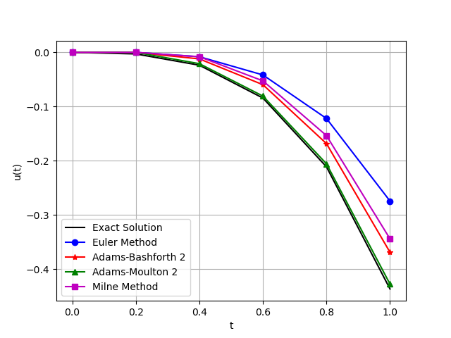
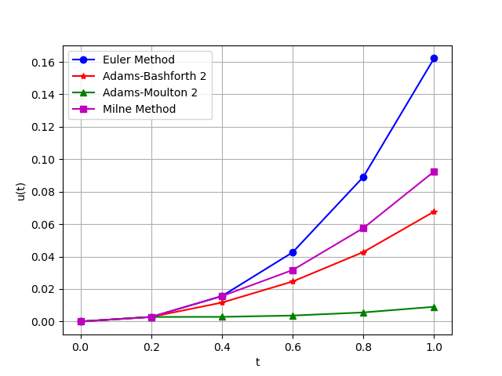

# 1

> 用待定系数法求三步四阶方法类，确定三步四阶显式方法

解：

$k$步$p$阶的待定系数方程组要求$$\sum_{j=0}^{k}j^i\alpha_j=i\sum_{j=0}^kj^{i-1}\beta_j, \quad i=0, 1, \dots, p $$，因此对于3步4阶方法，有如下系数方程组$$\begin{equation}
    \nonumber
    \left\{
    \begin{split}
        \alpha_0+\alpha_1+\alpha_2+\alpha_3 &= 0\\
        \alpha_1+2\alpha_2+3\alpha_3&=\beta_0+\beta_1+\beta_2+\beta_3\\
        \alpha_1+4\alpha_2+9\alpha_3&=2\beta_1+4\beta_2+6\beta_3\\
        \alpha_1+8\alpha_2+27\alpha_3&=3\beta_1+12\beta_2+27\beta_3\\
        \alpha_1+16\alpha_2+81\alpha_3&=4\beta_1+32\beta_2+108\beta_3
    \end{split}
    \right.
\end{equation} $$

因此有$$\begin{equation}
    \nonumber
    \left\{
    \begin{split}
        \alpha_0+\alpha_1+\alpha_2+\alpha_3 &= 0\\
        \alpha_1+2\alpha_2+3\alpha_3&=\beta_0+\beta_1+\beta_2+\beta_3\\
        2\alpha_2+6\alpha_3&=-\beta_0+\beta_1+3\beta_2+5\beta_3\\
        6\alpha_3&=2\beta_0-\beta_1+2\beta_2+11\beta_3\\
        0&=-6\beta_0+2\beta_1-2\beta_2+6\beta_3
    \end{split}
    \right.
\end{equation} $$

现在求一个显式方法，因此$\beta_3$取$0$。另外令$\alpha_3=1$，求解有$$\begin{equation}
    \nonumber
    \left\{
    \begin{split}
        \alpha_0+\alpha_1+\alpha_2+1 &= 0\\
        \alpha_1+2\alpha_2+3&=\beta_0+\beta_1+\beta_2\\
        2\alpha_2+6&=-\beta_0+\beta_1+3\beta_2\\
        6&=2\beta_0-\beta_1+2\beta_2\\
        18&=-\beta_1+4\beta_2
    \end{split}
    \right.
\end{equation} $$，最后有$$\begin{equation}
    \nonumber
    \left\{
        \begin{split}
            \alpha_0&=-\frac{9}{2}\beta_2+17 \\
            \alpha_1&=2\beta_2-9 \\
            \alpha_2&=\frac{5}{2}\beta_2-9 \\
            \alpha_3&=1\\
            \beta_0&=2\beta_2-6 \\
            \beta_1&=4\beta_2-18\\
        \end{split}
    \right.
\end{equation}$$

# 2

对初值问题$$\begin{equation}
\nonumber
\left\{\begin{split}
u'&=u-t^2,\quad 0\leq t\leq 1\\
u(0)&=0
\end{split}
\right. 
\end{equation}$$，分别用二阶显式、隐式Adams公式及Milne方法求解，取$\tau=0.2$，讨论格式的误差，并与精确解和Euler格式比较。

解：

容易得到精确解为$$u=t^2+2t+2-2e^t $$

分别使用二阶显式、隐式Adams，Milne方法，Euler格式求解，并将其得到的数值解与精确解绘制成图像画出。

根据结果就能发现，二阶隐式Adams方法的结果是最好的，其次是二阶显式Adams方法与Milne方法，最差的是Euler方法。

根据误差曲线能够更清晰地看到差别。

