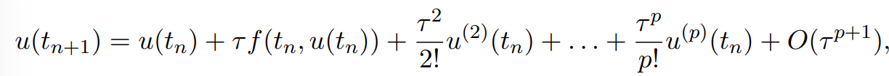
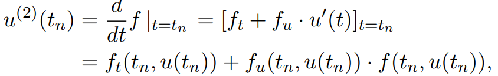
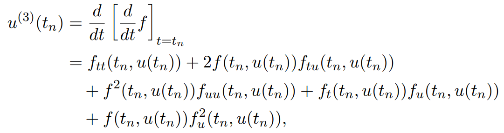

之前的线性单步法，即Euler法及其各种变形最高能到2阶精度。如果希望得到任意阶精度，就会希望使用其他方法。

本节是关于两种非线性高阶单步法。分别为**Taylor展开法**与**Runge-Kutta法**。

# p阶单步法

如果有$\phi(t,u(t),\tau)$，使得问题解$u(t)$满足$$u(t+\tau)=u(t)+\tau\phi(t,u(t),\tau)+O(\tau^{p+1}) $$，称其为**p阶单步法**。

## Taylor展开法

利用Taylor公式来计算。

现在需要确定这些$u$的高阶导是什么。使用全微分公式就有

复杂性是显然的。
