之前的线性单步法，即Euler法及其各种变形最高能到2阶精度。如果希望得到任意阶精度，就会希望使用其他方法。

本节是关于两种非线性高阶单步法。分别为**Taylor展开法**与**Runge-Kutta法**。

本节还证明了局部误差与全局误差的关系，证明了Lipschitz条件在判断方法收敛性上的作用，证明了一个有用的不等式，即Gronwall不等式。

# p阶单步法

如果有$\phi(t,u(t),\tau)$，使得问题解$u(t)$满足$$u(t+\tau)=u(t)+\tau\phi(t,u(t),\tau)+O(\tau^{p+1}) $$，称其为**p阶单步法**。

## Taylor展开法

利用Taylor公式来计算。

现在需要确定这些$u$的高阶导是什么。使用全微分公式就有

复杂性是显然的。这个方法一般不用。一般是用来计算一个附加值作为其他方法的附加初值。

## 单步法的性质

### 相容性

若满足$\phi$在$\tau=0$处连续，且有$$\phi(t,u(t),0)=f(t,u) $$，就称单步法**相容**。

这是因为对于式子$$u(t_{n+1})-u(t_n)=\tau\phi(t_n,u(t_n),\tau)+O(\tau^{p+1}) $$，这个式子可以带来下图的内容：

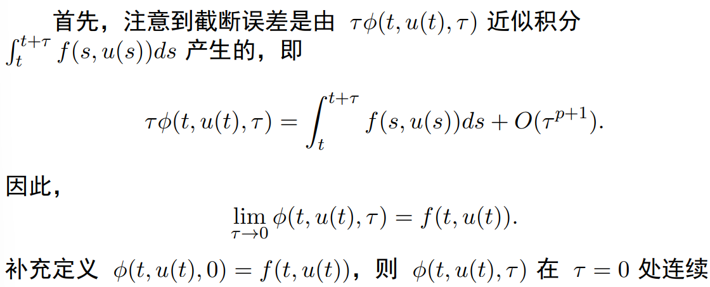

### 稳定性

若$\phi(t,u(t),\tau)$在$t\in[t_0,T],\tau\in[0,\tau_0],u\in(-\infty,\infty) $上关于$u$满足Lipschitz条件，则称单步法**稳定**。

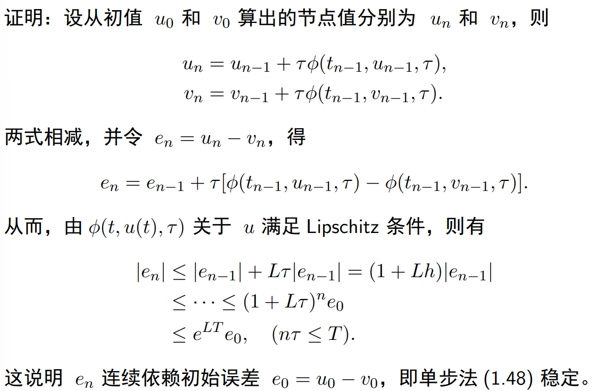

## Gronwall 不等式 / Bellman 不等式

**这是非常常用的不等式，务必记住。**

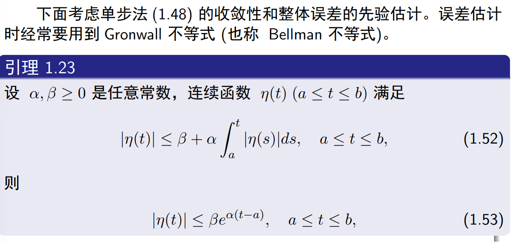

证明方法是很容易的，对右侧求导即可。这个证明可能需要有印象。

其离散形式为
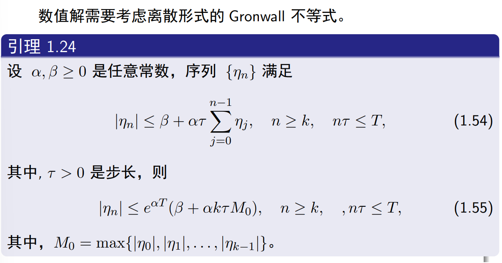

其证明稍微复杂一点，也可能需要有印象。

## 单步法的阶

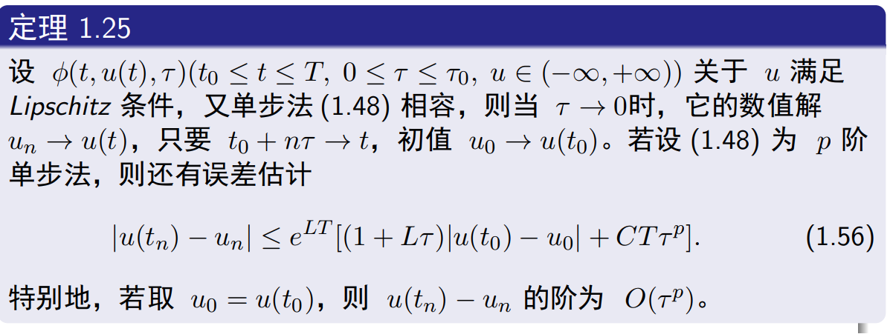

使用Gronwall证明即可。

可以有下面的结论

> 1. 判断显式单步法的收敛性，归结为了验证$\phi$是否满足Lipschitz条件。
> 2. 单步法的整体误差由初值误差和局部误差决定。整体误差比局部误差低一阶。
> 3. 要构造高精度计算方法，只需要设法提高局部截断误差阶即可。

这个结论解释了整体误差与局部误差的关系。

## Runge-Kutta 法

> 注意这门课对Runge-Kutta的解释并不合理，事实上容易造成误导。为了正确地理解Runge-Kutta法的思想，应当将其理解为对斜率的采样。
> 后面的内容并不合适。

Runge-Kutta法的$\phi$是取$[t,t+\tau]$上的$m$个点$t_1,t_2,...,t_m$，令$k_i=f(t_i,u(t_i)) $，让$$\phi(t_n,u_n,\tau)=\sum_{i=1}^m c_ik_i,\sum_{i=1}^mc_i=1 $$，使用待定系数法来确定系数$c_i$。该方法中，强制令$a_1=0$，也就是$t_1=t$

这里，令$$t_i=t+a_i\tau $$

但是由于$u(t_i) $未知，因此需要其他方法来求$k_i$

这把Runge-Kutta法分为了显式与隐式。

### 显式 Runge-Kutta

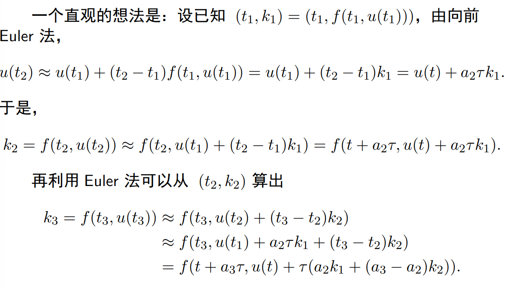

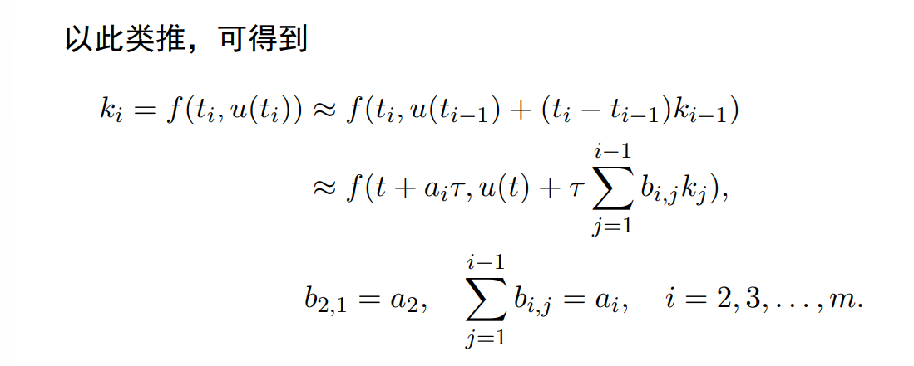

这里不是连等，而是连约等，这就意味着最后的$b_{ij}$实际上被给予了自由度。其只需要满足求和等于对应的$a_i$即可。

> 这种描述实际上十分混乱，可以参考使用斜率取样的描述来作为代替。
>
> 这里有助于理解的式子只有$$k_i=f(t+a_i\tau, u(t)+\tau\sum_{j=1}^{i-1}b_{i,j}k_j) $$

也就是说，直接使用一阶精度的$u_i$来代替$u(t_i) $，然后逐个求近似的$k_i$即可。

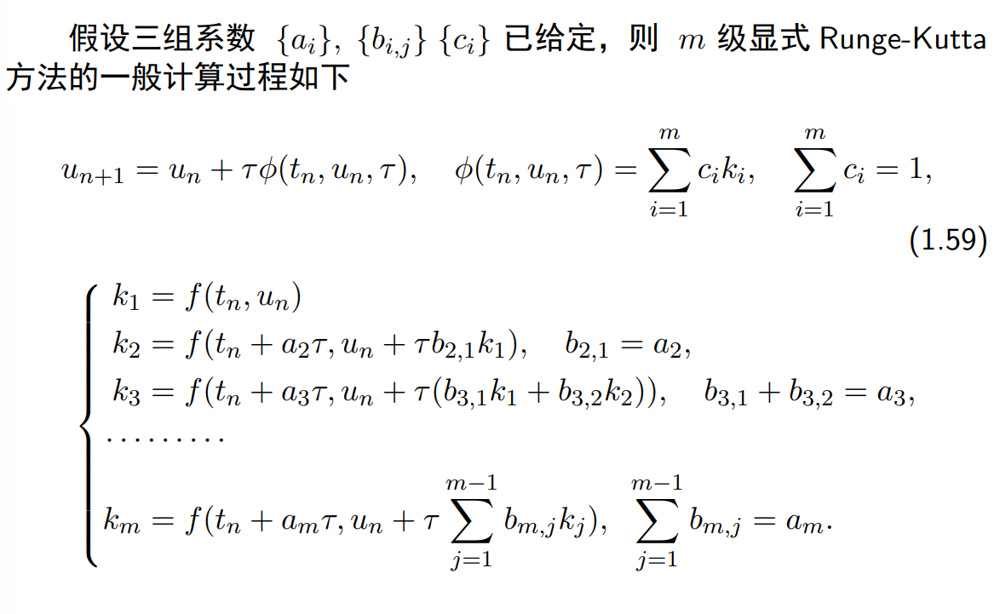

在此之后，只需要选取节点$t_i$和$c_i$来让式子尽量有更高的逼近阶。

使用Butcher表来表示一种Runge-Kutta方法。

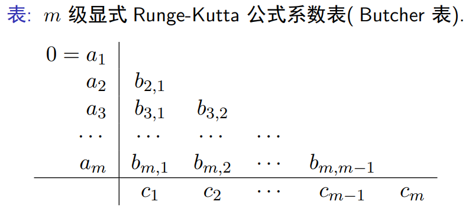

#### 对待定的系数进行求解

其实本质上就是把式子列出来，然后跟实际的泰勒展式逐个相等，最后剩下的就是泰勒展式的精度。

$m=1$就是前向Euler法。下面是$m=2$的例子

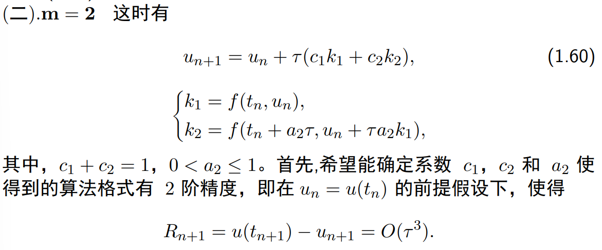
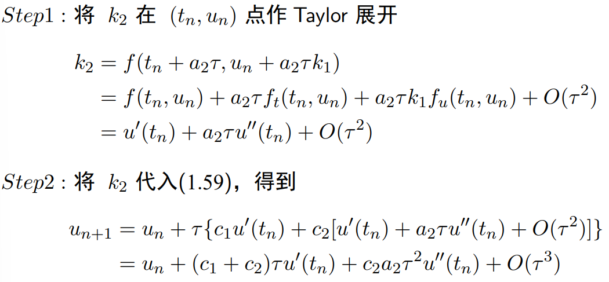
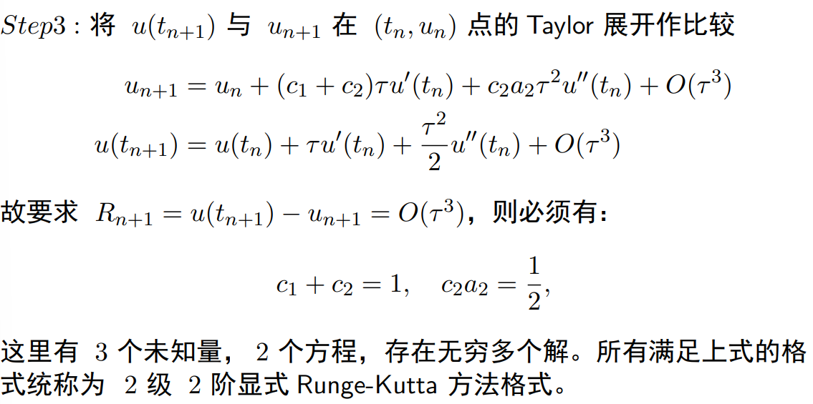

三阶、四阶也有类似的方法。

有定理

> 一个$m$级显式Runge-Kutta方法的阶不超过$m$
> 当$m\geq 5$时，不存在显式的Runge-Kutta方法了

### 隐式Runge-Kutta 法

使用$m$级隐式Runge-Kutta方法能达到的最高阶是$2m$。

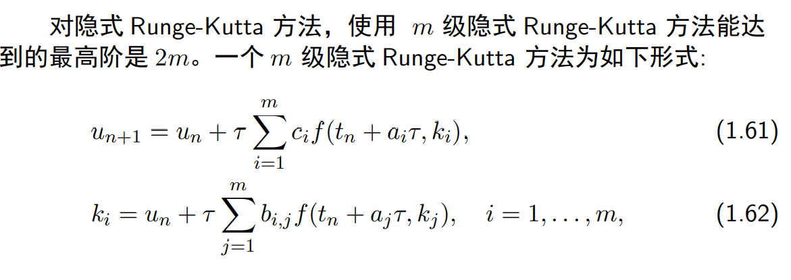
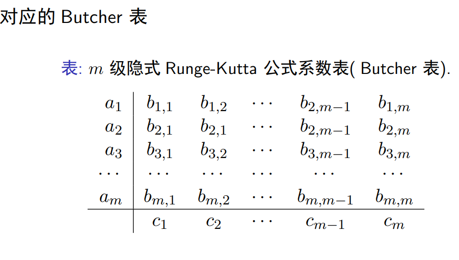

该方法的核心在，对$[t,t+\tau] $区间上，有$$u(t+\tau)=u(t)+\int_t^{t+\tau} f(s,u(s))\text{d}s $$，而该方法则需要构造一个次数小于$m$的多项式$P$来近似$f$，并在上式中替换，有$$u(t_{n+1})=u(t_n)+\int_{t_n}^{t_{n+1}} P(s)\text{d}s $$

插值方法使用Lagrange插值即可。此时

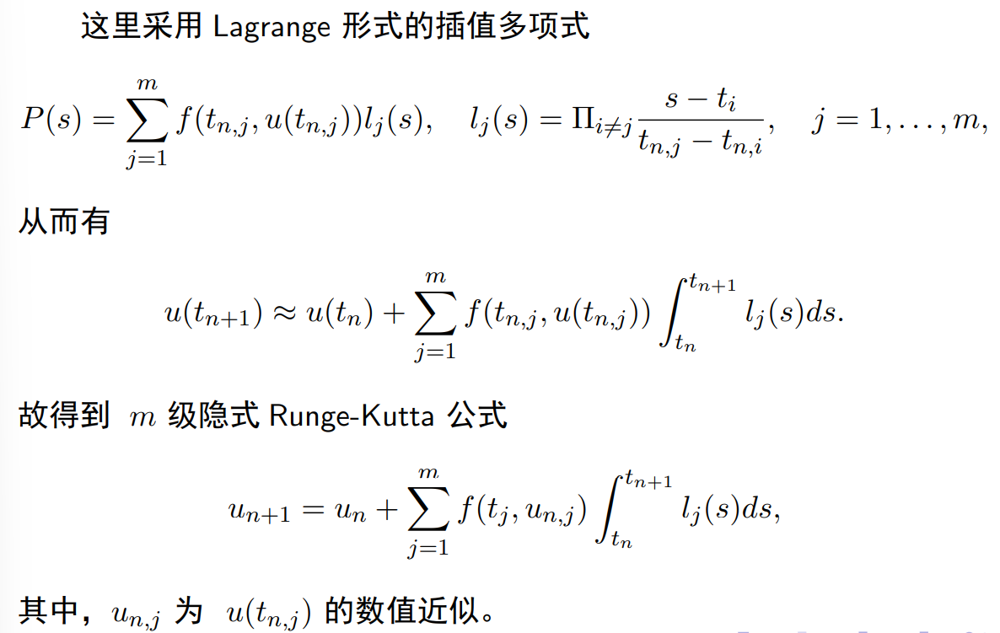

以$m=2$为例

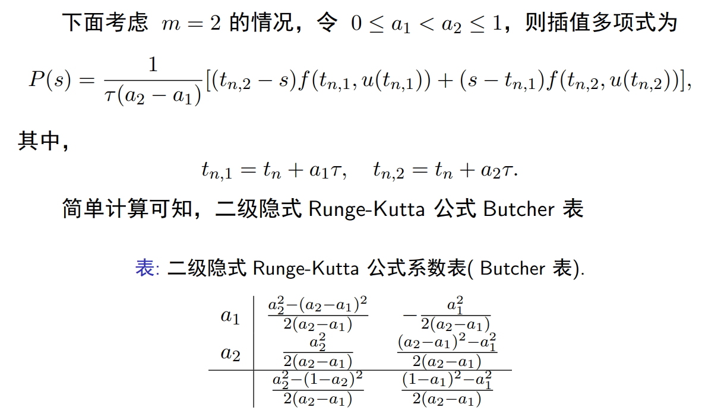

### Runge-Kutta法的误差分析

这里只给出显式的误差分析。

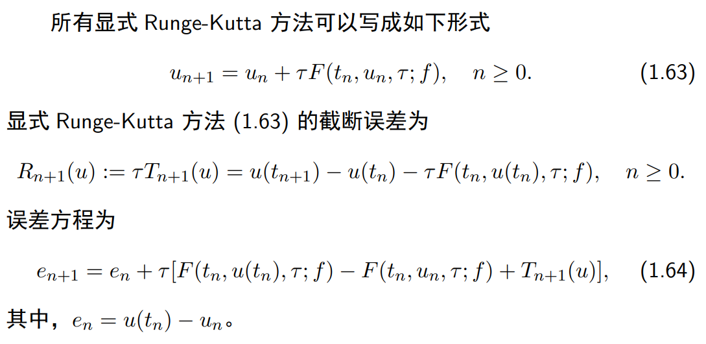

上面式子中，$R$是单步的截断误差，$T$则是一种表示全局截断误差阶的方式。而$T$的阶减去1即为方法的全局阶。

当方法局部截断误差为$p$阶误差时，全局误差为$p-1$阶，此时$T=O(\tau^{p-1})$，而$R=O(\tau^{p})$。

> 回忆局部截断误差是怎么算的。这个式子的意思就是，使用实际上单步函数值之差，减去计算用的单步函数值之差。
>
> 为什么$R$与$T$满足上面的性质，或者说为什么$T$能代表全局的阶？
>
> 实际上将$R$写为$\tau T$也有助于分析，比如方便使用Gronwall公式。
>
> **应当及时意识到，误差阶越高，误差越小。**

误差方程的推导如下

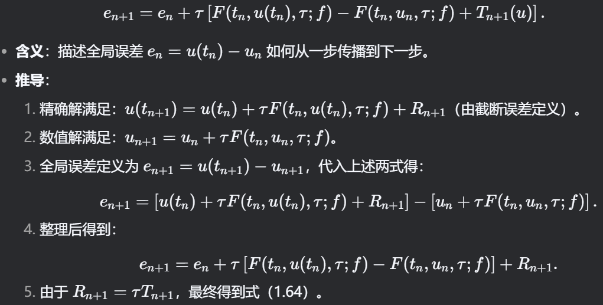

#### Runge-Kutta方法下的相容性条件

在Runge-Kutta方法下，$F(t, u, \tau,f)$就是前述的$\phi(t,u,\tau) $，因此其相容性也是定义为$$\lim_{\tau\to 0}F(t,u,\tau,f)=f(t,u) $$，于是可以有下面的结果。

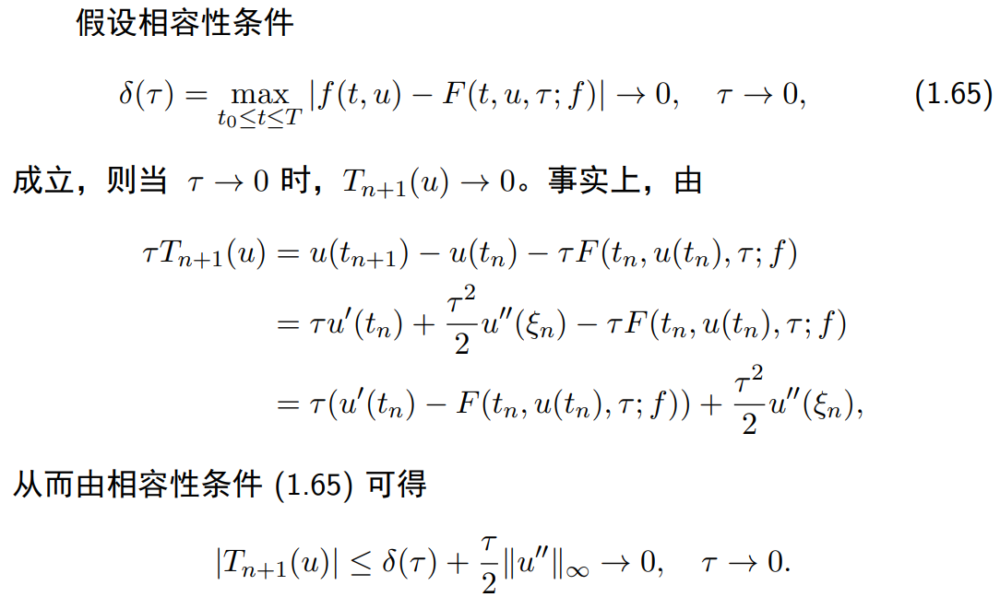
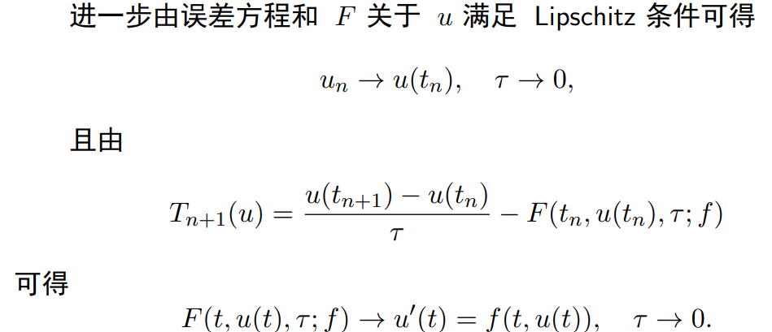

#### 误差

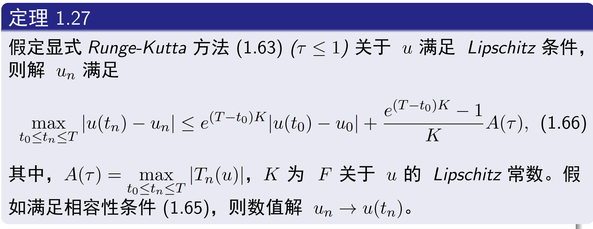

证明方法与之前的前向Euler方法是一致的。

### Runge-Kutta法中$u_n$收敛阶与(局部)截断误差的关系

对截断误差为$$R_{n+1}(u)=O(\tau^{p+1}) $$的方法，其$u_n$的收敛阶为$O(\tau^p)$

