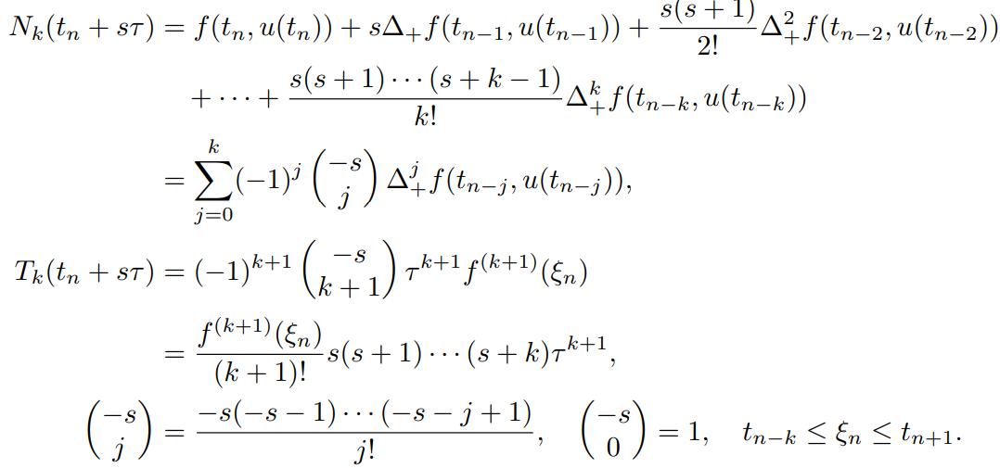

# 数值解法课程笔记 —— 线性多步法

本文总结了常微分方程初值问题数值解法中**线性多步法**的主要内容，既介绍了基本概念和公式，也讨论了方法的推导、局部截断误差、相容性、稳定性以及收敛性，为初学者提供了全面复习和深入理解的资料。

---

## 目录
- [数值解法课程笔记 —— 线性多步法](#数值解法课程笔记--线性多步法)
  - [目录](#目录)
  - [线性多步法简介](#线性多步法简介)
  - [基本形式及分类](#基本形式及分类)
    - [一般形式](#一般形式)
    - [显式与隐式](#显式与隐式)
  - [局部截断误差与相容性](#局部截断误差与相容性)
    - [局部截断误差定义](#局部截断误差定义)
    - [相容性](#相容性)
    - [阶](#阶)
    - [相容性的充要条件](#相容性的充要条件)
  - [数值积分法导出 Adams 法](#数值积分法导出-adams-法)
    - [Adams 外插法（显式）](#adams-外插法显式)
    - [Adams 内插法（隐式）](#adams-内插法隐式)
  - [待定系数法](#待定系数法)
  - [预估-校正方法](#预估-校正方法)
  - [局部截断误差-相容性-稳定性与收敛性和误差估计](#局部截断误差-相容性-稳定性与收敛性和误差估计)
    - [局部截断误差与相容性](#局部截断误差与相容性-1)
    - [稳定性](#稳定性)
    - [收敛性与误差估计](#收敛性与误差估计)
    - [小结](#小结)
  - [总结](#总结)

---

## 线性多步法简介

在求解初值问题
\[
u'(t)=f(t,u),\quad u(0)=u_0,
\]
数值方法分为两大类：
- **单步法**：如 Euler 法、Runge-Kutta 法，计算 \( u_{n+1} \) 只依赖于当前步的信息。
- **多步法**：在计算 \( u_{n+1} \) 时利用前 \( k+1 \) 个节点上的解，即 \( u_n, u_{n-1}, \ldots, u_{n-k} \)；代表方法有 Adams 方法等。

---

## 基本形式及分类

### 一般形式

\( k+1 \) 步多步法的标准形式为
\[
\sum_{j=0}^{k} \alpha_j\, u_{n-j} = \tau \sum_{j=-1}^{k} \beta_j\, f(t_{n-j}, u_{n-j}), \quad (1.67)
\]
其中：
- \(\alpha_j\)（\(j=0,1,\dots,k\)）和 \(\beta_j\)（\(j=-1,0,\dots,k\)）为常数，
- 要求 \(\alpha_k \beta_k \neq 0\)。
- 当 \(k=0\) 时（且取 \(\alpha_0=\beta_0=1\), \(\beta_{-1}=0\)），该格式退化为向前 Euler 法。

### 显式与隐式

- **显式法**：当 \(\beta_{-1}=0\)，\(u_{n+1}\)只在右侧出现一次，便于直接计算。
- **隐式法**：当 \(\beta_{-1}\ne 0\)，\(u_{n+1}\)出现在等式两边，此时通常需要迭代求解。当满足 \(\tau |\beta_{-1}|L < 1\)（其中 \(L\) 是 Lipschitz 常数）时，迭代可以收敛。

---

## 局部截断误差与相容性

### 局部截断误差定义

对于格式 (1.67)，定义局部截断误差为
\[
R_{n+1}(u) = u(t_{n+1}) - \left[ \sum_{j=0}^{k} \alpha_j\, u(t_{n-j}) + \tau \sum_{j=-1}^{k} \beta_j\, f(t_{n-j}, u(t_{n-j})) \right],
\]
并引入
\[
T_{n+1}(u) = \frac{1}{\tau} R_{n+1}(u).
\]

### 相容性

相容性要求: 

当 \(\tau\to 0\)时
\[
\delta(\tau) = \max_{0\le t\le T} |T_{n+1}(u)| \to 0.
\]

### 阶

当 \(u(t)\)足够光滑时，若 \(R_{n+1}(u)=O(\tau^{p+1})\)，则称该方法为 \(p\) 阶方法。

一个初值问题的多步法是相容的，当且仅当它至少是一阶的。

### 相容性的充要条件

为使得多步法相容，必要条件是
\[
\sum_{j=0}^{k} \alpha_j = 1,\quad -\sum_{j=0}^{k} j\alpha_j + \sum_{j=-1}^{k} \beta_j = 1.
\]
更一般地，为保证 \(R_{n+1}(u)=O(\tau^{p+1})\)，需满足
\[
\sum_{j=0}^{k} (-j)^i \alpha_j + i \sum_{j=-1}^{k} (-j)^{i-1} \beta_j = 1,\quad i=0,1,\dots,p.
\]
这种条件为确定方法阶提供了依据。

事实上，待定系数法只需要解这样的方程，得到的就是有对应阶的系数了。但是，待定系数法使用得更多的是另一组等价的方程组。

---

## 数值积分法导出 Adams 法

多步法的一种重要推导方法是利用数值积分思想，将微分方程在区间 \([t_n, t_{n+1}]\) 上积分：
\[
u(t_{n+1}) - u(t_n) = \int_{t_n}^{t_{n+1}} f(t, u(t)) \, dt.
\]
通过对积分右侧进行数值积分，可以构造不同的多步法。

### Adams 外插法（显式）

- **思想**：利用 \(k+1\) 个节点 \(t_n, t_{n-1}, \dots, t_{n-k}\) 上的 \(f(t,u)\) 构造 \(k\) 次牛顿向后插值多项式 \(N_k(t)\)，然后近似积分。
- 得到公式形式：
  \[
  u_{n+1} = u_n + \tau \sum_{j=0}^{k} a_j\, \Delta^+ f(t_{n-j}, u_{n-j}),
  \]
  经过差商转换，可写为
  \[
  u_{n+1} = u_n + \tau \sum_{l=0}^{k} b_{k,l}\, f(t_{n-l}, u_{n-l}), \quad (1.70)
  \]
- 局部截断误差为 \(O(\tau^{k+2})\)。具体的公式为 \[R_{n+1}=\tau\int_0^1T_k(t_n+s\tau)\text{d}s=a_{k+1}\tau^{k+2}u^{(k+2)}(\xi_n) \]
- 这里面提到的\(a_j,b_{kl} \)等均可以通过查表得到。

### Adams 内插法（隐式）

- **思想**：利用 \(k+2\) 个节点 \(t_{n+1}, t_n, \dots, t_{n-k}\) 构造 \(k+1\) 次牛顿向后插值多项式，并对积分进行内插近似。
- 得到公式：
  \[
  u_{n+1} = u_n + \tau \sum_{j=0}^{k+1} a^*_j\, \Delta^+ f(t_{n-j+1}, u_{n-j+1}), \quad (1.71)
  \]
  或转换为
  \[
  u_{n+1} = u_n + \tau \sum_{l=0}^{k+1} b^*_{k+1,l}\, f(t_{n-l+1}, u_{n-l+1}), \quad (1.72)
  \]
- 局部截断误差阶为 \(O(\tau^{k+3})\)（比外插法**高一阶**）。具体的公式为\[R_{n+1}=\tau\int_{-1}^0T_{k+1}(t_{n+1}+s\tau)\text{d}s=a_{k+2}^*\tau^{k+3}u^{(k+3)}(\xi_n) \]

- **比较**：内插法通常由于采用更多节点而具有**更高的阶**和更好的舍入误差控制，但需要求解隐式方程（通常通过迭代）。

---

## 待定系数法

另一种推导高阶多步法的方法是**待定系数法**。假设给定多步格式
\[
\sum_{j=0}^{k} \alpha_j\, u_{n+j} = \tau \sum_{j=0}^{k} \beta_j\, f(t_{n+j}, u_{n+j}), \quad (1.74)
\]
通过将 \(u(t+n\tau)\) 和 \(u'(t+n\tau)\) 进行 **Taylor 展开**，整理后得到形式
\[
L(u(t);\tau) = \sum_{i=0}^{\infty} c_i \tau^i u^{(i)}(t),
\]
系数 \(c_i\) 与 \(\alpha_j, \beta_j\) 之间存在一系列关系。
\[
\begin{equation}
\nonumber
\left\{
    \begin{split}
        c_0&=\sum_{i=0}^k\alpha_i,\\
        c_1&=\sum_{i=0}^kia_i-\sum_{i=0}^k\beta_i\\
        &\dots\\
        c_p&=\frac{1}{p!}\sum_{i=0}^ki^p\alpha_i-\frac{1}{(p-1)!}\sum_{i=0}^ki^{p-1}\beta_i
    \end{split}
\right.
\end{equation}    
\]
为达到 \(p\) 阶精度，要求
\[
c_0 = c_1 = \cdots = c_p = 0, \quad c_{p+1} \neq 0.
\]
通过求解这些方程，可以确定多步公式中所有待定系数\(\alpha_j,\beta_j\)。

> 这与之前讨论相容性中提到的方程组等价。

PPT中以二步法为例推导出一般形式：
\[
u_{n+2} - (1+\alpha) u_{n+1} + \alpha u_n = \frac{\tau}{12} \Big[(5+\alpha) f_{n+2} + 8(1-\alpha) f_{n+1} - (1+5\alpha) f_n\Big]. \quad (1.75)
\]，对这样的推导需要有印象。
- 当 \(\alpha = 0\)时，该公式为二步 Adams 内插法；
- 当 \(\alpha = -5\)时，方法阶提高（但可能导致不稳定）。
- 还有其他方法，具体参考

---

## 预估-校正方法

为兼顾计算简单与稳定性，可采用**预估-校正法**。其基本步骤：
1. **预测（显式）**：先用显式 Euler 公式得到预测值
   \[
   \bar{u}_{n+1} = u_n + \tau f(t_n, u_n).
   \]
2. **校正（隐式）**：利用预测值在隐式梯形公式中校正
   \[
   u_{n+1} = u_n + \frac{\tau}{2}\Big(f(t_n, u_n) + f(t_{n+1}, \bar{u}_{n+1})\Big).
   \]
该方法具有 2 阶精度，并且比单纯隐式公式的迭代求解过程简单，同时具有较高稳定性。

这里没有证明。

---

## 局部截断误差-相容性-稳定性与收敛性和误差估计

### 局部截断误差与相容性

对于 k 步方法
\[
\sum_{j=0}^{k} \alpha_j\, u_{n+j} = \tau \sum_{j=0}^{k} \beta_j\, f(t_{n+j}, u_{n+j}), \quad (1.78)
\]
考虑真实解 \(u(t)\)（满足 \(u'(t)=f(t,u(t))\)）在节点 \(t=t_n\) 的泰勒展开，定义**局部截断误差**（或称差分算子）为
\[
L[u(t);\tau] = \sum_{j=0}^{k} \alpha_j\, u(t+j\tau) - \tau \sum_{j=0}^{k} \beta_j\, u'(t+j\tau).
\]
假设 \(u(t)\)具有 \(p+2\) 阶连续导数，则经过 Taylor 展开后，可以写成
\[
L[u(t);\tau] = c_{p+1}\,\tau^{p+1} u^{(p+1)}(t) + O(\tau^{p+2}),
\]
其中系数 \(c_{p+1}\)由 \(\alpha_j\)与\(\beta_j\)决定。为保证方法的局部截断误差满足
\[
\frac{1}{\tau} L[u(t);\tau] \to 0 \quad \text{当} \ \tau\to 0,
\]
即要求
\[
L[u(t);\tau] = o(\tau), \quad \tau\to 0.
\]
这就是多步法的**相容性**要求。

进一步，通过将 \(u(t+n\tau)\)和\(u'(t+n\tau)\)进行 Taylor 展开，整理同次幂系数，可证明：

**定理 1.31（相容性判据）：**  
多步法 (1.78) 相容的充要条件为
\[
\rho(1)=0,\quad \rho'(1)=\sigma(1),
\]
其中
\[
\rho(\lambda)=\sum_{j=0}^{k}\alpha_j\lambda^j,\quad \sigma(\lambda)=\sum_{j=0}^{k}\beta_j\lambda^j.
\]
证明过程在文档中是通过将 \(L[u(t);\tau]\) 按 \(\tau\)的幂次展开，并令前 0 阶和 1 阶系数为 0，从而得到上述条件。

这与前面的相容性叙述一致。

### 稳定性

稳定性讨论的是初值误差或舍入误差在计算过程中是否被控制。定义如下：

**定义 1.32：**  
若存在常数 \(C\)（不依赖于步长 \(\tau\)）和 \(\tau_0>0\)，使得对任意两个解 \(\{u_n\}\) 和 \(\{v_n\}\)（其初值可能不同），当 \(n\tau \le T\) 时都有
\[
\max_{n\tau\le T}|u_n - v_n| \le C \max_{0\le j<k}|u_j - v_j|,
\]
则称该 k 步法稳定。

稳定性判据依赖于第一特征多项式
\[
\rho(\lambda)=\sum_{j=0}^{k}\alpha_j\lambda^j.
\]
**定理 1.33：**  
k 步法 (1.78) 稳定的充要条件是 \(\rho(\lambda)\) 的所有根均满足
\[
|\lambda|\le 1,
\]
且当 \(|\lambda|=1\)时，\(\lambda\)必须为单根。

**证明过程（摘录自文档）：**

   这里的证明比较trivial，可以看[PPT](../../ppt/1.4%20线性多步法.pdf)了解更多。不一定是考点。
1. **必要性：**  
    非齐次情形复杂了，这里仅考虑齐次形式下的情形。
   - 考察齐次问题 \(u'=0\)时的差分格式：
     \[
     \sum_{j=0}^{k} \alpha_j\, u_{n+j} = 0.
     \]
   - 设该差分方程的通解为线性组合形式，当存在某个根 \(\lambda\) 满足 \(|\lambda|>1\)时，可构造出形如 \(u_n = \lambda^n\)的解，使得当 \(n\to\infty\)时 \(u_n\)发散，与稳定性定义矛盾。
   - 同理，若在单位圆上存在重根 \(\lambda\)（即代数重数大于 1），则对应的解形式为 \(u_n = n\lambda^n\)，误差将线性增长，同样违反稳定性要求。

2. **充分性：**  
   - 当所有根都满足 \(|\lambda|\le1\)且单位圆上的根均为单根时，可以利用特征根分解将误差递推关系写成向量形式
     \[
     E_{n+1} = C\,E_n + B_n,
     \]
     其中 \(E_n\)为包含 \(k\) 个连续误差分量的向量，矩阵 \(C\) 的特征半径小于 1。
   - 利用递归与 Gronwall 不等式，可以证明存在常数 \(M\)使得
     \[
     \|E_n\| \le M \|E_0\|,
     \]
     即误差受初值影响有界，从而证明方法稳定。

> 需要能够判断算法的稳定性，可以看PPT的例题。

### 收敛性与误差估计

在多步法中，整体误差 \(e_n = u(t_n)-u_n\)同时受到局部截断误差和初始数据误差的影响。设真解满足
\[
\sum_{j=0}^{k}\alpha_j\, u(t_{n+j}) = \tau \sum_{j=0}^{k}\beta_j\, f(t_{n+j}, u(t_{n+j})) + L[u(t_n);\tau],
\]
而数值解满足
\[
\sum_{j=0}^{k}\alpha_j\, u_{n+j} = \tau \sum_{j=0}^{k}\beta_j\, f(t_{n+j}, u_{n+j}).
\]
两式相减，得整体误差满足
\[
\sum_{j=0}^{k}\alpha_j\, e_{n+j} = \tau\, b_n + L[u(t_n);\tau],
\]
其中
\[
b_n = \sum_{j=0}^{k}\beta_j\Big(f(t_{n+j}, u(t_{n+j}))-f(t_{n+j}, u_{n+j})\Big).
\]

利用稳定性证明中的误差递推形式，可以推导出误差估计公式：
\[
\|E_n\| \le e^{K_2 T}\Big((K_1 +K_2\tau)\|E_0\| + M_{p+1}T\,\tau^p\Big), \quad n\tau\le T, \quad (1.85)
\]
其中：
- \(E_n\)是包含连续 k 个误差分量的向量；
- \(K_1,\,K_2\)为与方法系数及 Lipschitz 常数相关的正常数；
- \(M_{p+1}\)与截断误差主项系数 \(c_{p+1}\)和 \(u^{(p+1)}(t)\)的上界有关。

**定理 1.35（收敛性定理）：**  
若多步法 (1.78) 相容且稳定，则当 \(\tau \to 0\)时数值解 \(u_n \to u(t_n)\)；若方法为 p 阶方法，则有上述误差估计式 (1.85)。

**证明过程（摘录）：**  
- 利用局部截断误差与一致稳定性，通过构造误差递推关系 \(E_{n+1} = C\,E_n + B_n\)；
- 对 \(B_n\)使用 Lipschitz 条件估计，并利用 Gronwall 不等式，最终得到整体误差界限；
- 由此证明在相容和稳定条件下，整体误差趋于零，即方法收敛。

---

### 小结

- **局部截断误差** 的分析通过 Taylor 展开得出，其主项为 \(c_{p+1}\tau^{p+1}u^{(p+1)}(t)\)，相容性要求 \(\rho(1)=0\)和\(\rho'(1)=\sigma(1)\)。
- **稳定性** 依赖于第一特征多项式 \(\rho(\lambda)\) 的根条件，证明过程分为必要性（通过构造发散解证明）和充分性（利用误差向量和 Gronwall 不等式证明）。
- **收敛性** 则由相容性与稳定性共同保证，并能通过误差递推式给出全局误差估计。

---

## 总结

- **线性多步法**利用多个先前节点的信息，具有较高的潜在精度，但对初值选取、相容性、稳定性要求较高。
- 通过**数值积分法**可以推出 Adams 系列公式，其中外插法为显式、内插法为隐式，两者局部截断误差阶分别为 \(O(\tau^{k+2})\) 和 \(O(\tau^{k+3})\)。
- **待定系数法**通过 Taylor 展开确定系数，是构造高阶多步法的另一种有效方法。
- **预估-校正方法**兼顾显式计算简单和隐式方法的稳定性，是实际应用中常用的策略。
- 稳定性分析依赖于特征多项式的根条件，而收敛性则由相容性与稳定性共同保证。

<!-->
---

# 多步法

单步法是给出初值就能算的方法，$k+1$步多步法是需要$k+1$个初值的方法。

## 多步法的一般形式

$$u_{n+1}=\sum_{j=0}^k\alpha_ju_{n-1}+\tau\sum_{j=-1}^k\beta_jf(t_{n-j},u_{n-j}) $$

对于$\beta_{-1}\neq 0$，就是隐式法。

> 隐式法迭代收敛的条件：
>
> $\tau|\beta_{-1}|L\lt 1$
>
> 为什么？回忆迭代方程收敛的条件：
> $$x_{k+1}=f(x_k)\text{收敛}\iff |f(x)-f(y)|\leq L |x-y|,L<1 $$

多步法计算用到的信息更多，可能塑造出更高精度的算法。其截断误差$$R_{n+1}(u)=u(t_{n+1})-[\sum_{j=0}^k\alpha u(t_{n-j})+\tau\sum_{j=-1}^k\beta_jf(t_{n-j,u(t_{n-j})})] $$，另外定义$$T_{n+1}(u)=\frac{1}{\tau}R_{n+1}(u) $$，并且令$$\delta(\tau)=\max_{0\leq t\leq T}|T_{n+1}(u)| $$

## 多步法相容性：

相容性条件$$\delta(\tau)\to 0 $$

相容性条件的充要条件$$\sum_{j=0}^k\alpha_j=1 $$$$-\sum_{j=0}^kj\alpha_j+\sum_{j=-1}^k\beta_j=1 $$

事实上，上面两条是$0$阶、$1$阶的条件。如果对于$p$阶方法(定义在下)，其实就是$$\sum_{j=0}^k(-j)^p\alpha_j+p\sum_{j=-1}^k(-j)^{p-1}\beta_j=1 $$

并且小于$p$阶的条件也都必须满足。

> 在下面的待定系数法的Taylor展开叙述中还有另一种叙述。

## 多步法的阶数

对于$$\delta(\tau)=O(\tau^p) $$，就认为方法具有$p$阶。

## 推导高阶多步法的方法

这里给出的是**获得高阶多步法系数的方法**。

有两种，分别是**数值积分法**与**待定系数法**。

### 数值积分法

思想是$$u(t_{n-1})-u(t_n)=\int_{t_n}^{t_{n+1}}f(t,u(t))\text{d}t $$，此时只需要近似出右边的积分就可以。

可以使用$k$次Lagrange插值多项式来近似替代$f$。

#### Admas外插法

又称Admas-Bashorth法，是一种**显式多步法**。

对$f$在$t_{n-k},...,t_{n-1},t_n $处做牛顿向后插值。

首先给出PPT的牛顿插值，其中$T_k$为对应误差项。

> 数值分析的格式为$$P_n(x) = f[x_0] + f[x_0, x_1](x - x_0) + \cdots + f[x_0, x_1, \dots, x_n](x - x_0)(x - x_1)\cdots(x - x_{n-1})$$，其中差商的定义为$$f[x_0, x_1, \dots, x_k] = \frac{f[x_1, x_2, \dots, x_k] - f[x_0, x_1, \dots, x_{k-1}]}{x_k - x_0}$$，误差项为$$T_n(x) = f(x) - P_n(x) = f[x_0, x_1, \dots, x_n, x] \cdot \prod_{i=0}^n (x - x_i)\\T_n(x) = \frac{f^{(n+1)}(\xi)}{(n+1)!} \cdot \prod_{i=0}^n (x - x_i) $$

> Adams 外插公式的局部截断误差阶为$O(\tau^{k+2})$

#### Adams内插法

Admas-Moulton法，是隐式多步法。

与外插法基本相同，只是插值点加上了所求点，因此变成了一个隐式方法。

> Adams 内插公式的局部截断误差阶为$O(\tau^{k+3})$，比外插法高一阶。

> Adams 内插和外插两者区别：
> (1). 就绝对值系数比较，内插法中舍入误差影响比外插法小。
> (2). 利用的已知量保持一致的情况下，内插法比之高一阶。
> (3). 显式直接解方程，隐式需迭代求解。

事实上，如果修改积分区间，可以构造成其他积分形式。

内插法和外插法的系数可以通过查表得到。

> 注意二步的例子，需要可以查阅[这里](../../ppt/1.4%20线性多步法.pdf)观看ppt中的算例。

### 待定系数法

#### 一般解法

根据之前给出的$k+1$步法$p$阶的相容性条件$$\sum_{j=0}^k\alpha_j=1 $$$$\sum_{j=0}^k(-j)^i\alpha_j+i\sum_{j=-1}^k(-j)^{i-1}\beta_j=1,i=1,2,\dots, p $$。这里面有$2k+3$个待定系数，$p+1$个方程。求出一组解即可。

#### 使用Taylor展开方法

> 此处也需要注意能够做二步法。需要可以查阅[这里](../../ppt/1.4%20线性多步法.pdf)观看ppt中的算例。

##### 未完
</-->